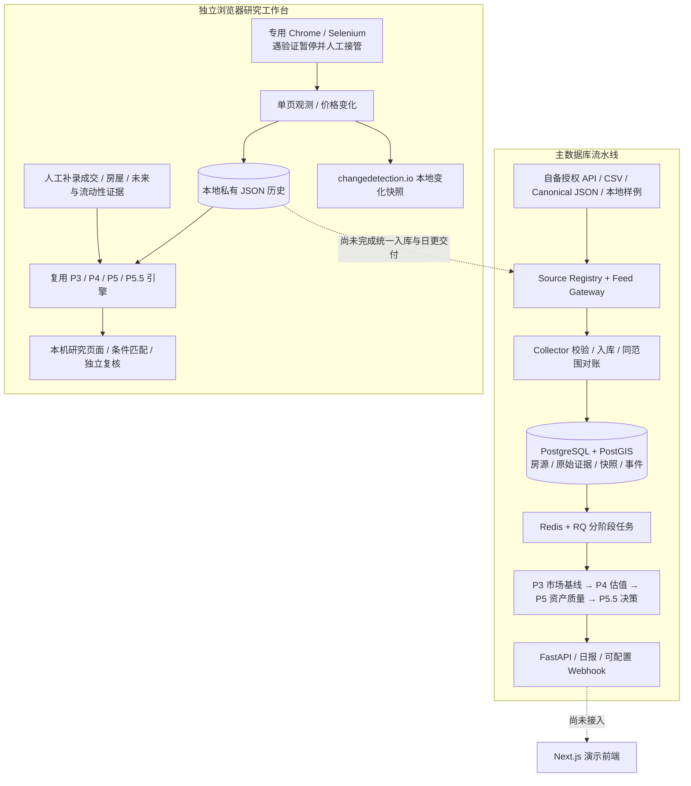

# Shanghai Home Radar

面向上海二手房买方的自托管研究工具。目标是持续积累房源和价格变化，再解释每天哪些房源值得跟踪。

Self-hosted housing research, change tracking, and explainable decision support for Shanghai resale homes.

> **当前状态：研究原型，不是开箱即用的实时房源服务。**
> 已有采集、历史、估值、风险与盲测代码，但稳定的数据供给、统一每日入口和真实效果验证仍未完成。
> 仓库不提供房源网站账号、合作方 API、真实房源数据集或经验证的投资建议。代码可运行不等于数据新鲜，也不等于推荐可信。

## 项目希望解决什么

每天打开一个入口，看到新增、降价和符合个人条件的候选；每套都能回到原始证据，回答为什么值得跟踪、缺什么资料。

目前应区分三件事：

1. **发现线索**：公开网页或搜索结果中找到一套房。
2. **持续盯盘**：定时重新观察、识别同一房源、记录变化和失败。
3. **可信筛选**：结合可比房、真实成交、房屋条件和独立人工验证形成候选。

浏览器或搜索工具能完成第一件事，不代表第二、第三件事已经接入本项目。项目也不是完全没有网页数据，而是存在两条尚未统一的运行链路。

## 当前架构



### A. 主数据库流水线

- 入口是 [`registry.py`](services/collector/src/home_radar_collector/registry.py)。已有 Canonical JSON、合作方 CSV 与授权 HTTP API 适配器；认证和分页代码不等于已取得数据服务。
- [`CollectorService`](services/collector/src/home_radar_collector/service.py) 保存原始证据、房源投影、不可变快照与事件。只有成功且完整的同来源、同范围采集可以推断缺失。
- [`daily_update_pipeline.py`](scripts/daily_update_pipeline.py) 串行编排采集与 P3–P5.5，检查 RQ 任务结果，生成带批次信息的日报；[`daily_scheduler.py`](scripts/daily_scheduler.py) 提供每日调度、补跑和有限重试。
- 数据持久化在 Postgres；API、队列和各模型服务的部署见 [`docker-compose.yml`](docker-compose.yml)。
- **若输入仍是同一份 SAMPLE 文件，每天执行成功只代表重算成功，不代表获取了当天行情。** 模型生成时间不能替代来源观测时间。

### B. 独立浏览器研究工作台

- [`browser_handoff.py`](scripts/browser_handoff.py) 管理 `PAUSED / NEEDS_HUMAN / READY`；支持专用 Selenium 浏览器和 [`本机 Chrome 模式`](scripts/local_browser_handoff.py)。不使用日常 Chrome 的个人配置。
- 当前解析范围是一个徐汇 250–300 万元公开挂牌筛选页，不是上海全量搜索器。默认到期检查间隔为六小时，**不是秒级实时推送**。
- 原始观测、变化、派生报告存入本地文件。读取页面或接口不会触发新的来源访问。启动、验证失败、会话失效后需要人工确认恢复；电脑休眠或进程关闭会中断监控。
- [`research_pipeline.py`](scripts/research_pipeline.py) 直接复用现有模型，按同页可比挂牌及额外核验证据分析。没有足够证据就保留缺失，不用旧校准池或虚构分数补齐。
- [`recommendation_routes.py`](scripts/recommendation_routes.py) 已提供购房条件、证据导入和独立盲审入口；入口存在不代表真实资料已齐全。
- 默认入口是 `http://127.0.0.1:5057/`。它不写入主数据库，也不自动进入主日更通知。changedetection.io 只观察本地快照，不代替采集器或估值引擎。

### 组件与实现状态

| 部分 | 已有实现 | 仍缺什么 |
| --- | --- | --- |
| P0–P2 数据生命周期 | 原始证据、快照、事件、幂等、范围锁、完整性保护 | 跨平台物理房源去重、真实来源持续覆盖验收 |
| Feed Gateway | JSON / CSV / 分页授权 API、认证、错误分类 | 合作方地址、凭据、授权范围和数据质量协议 |
| 浏览器监控 | 独立会话、人工接管、单页观察、价格变化 | 多区域配置、稳定覆盖、解析漂移检测、与主池统一 |
| P3 市场基线 | 分层统计、样本量与置信度、时间窗口 | 足够宽且可核查的当前市场与成交样本 |
| P4 Fair Value / Value Score | 可比选择、调整、区间、解释、缓存 | 真实成交校准；挂牌参考价不能直接视为成交价值 |
| P5 Future / Obsolescence | 分离的资产质量与淘汰风险、证据与覆盖门槛 | 实测就业、交通位置、供应与租赁等有效证据 |
| P5.5 决策编排 | 四象限、资格门槛、工作流、排序、Why Ranked | 足量真实可排名房源和效果验证；不解锁 `ATTACK` |
| P5.6 / P5.7 盲测 | 输入隔离、人工标签冻结、指纹、揭示、KPI | 人工独立标注及真实新房源复测，不能由 AI 代填 |
| 买方研究工作台 | 条件匹配、补证、独立复核页面 | 统一每日候选入口；不等同于 P6 已验收 |
| 日报与通知 | 主流水线摘要、可配置 Webhook、投递重试 | 浏览器新观测到买方通知的统一验收、离线接管提醒 |
| `apps/web` | Next.js 演示页面，数据来自本地 fixture | 尚未接通真实决策 API，不是今日行情页面 |
| P8–P10 | 浏览器询盘等模块边界与设计 | 经纪人询盘、卖方情报、议价助手未交付 |

## 数据与模型边界

### 三种数据模式不是新鲜度等级

| 模式 | 含义 |
| --- | --- |
| `demo` | 合成数据，供测试和演示 |
| `sample` | 研究数据；可能来自真实公开页面，但不宣称生产覆盖、真实性或成交校准 |
| `live` | 生产数据模式，需另行验证来源、授权、时效与覆盖；改一个配置值不能完成这些验证 |

必须分别保留来源观测时间、处理时间、模型生成时间、来源标识、范围和完整性。旧观测重算后仍是旧观测。首次见到也不等于网站当天新挂牌。

浏览器数据维持 `sample / partial / private_research_only`。单页未出现不能推断下架；主流水线的 `inactive` 也只表示满足监控范围缺失条件，不证明成交。

### 决策不是一个黑盒大总分

P3 回答市场价格水平，P4 回答当前相对价格，P5 回答资产质量与风险，P5.5 只组合这些结果。

| 估值吸引力 | 资产质量 | 分类 |
| --- | --- | --- |
| 高 | 高 | `QUALITY_AT_DISCOUNT` |
| 低 | 高 | `GOOD_BUT_EXPENSIVE` |
| 高 | 低 | `VALUE_TRAP` |
| 低 | 低 | `LOW_QUALITY` |
| 缺少必要证据 | 任意 | `INSUFFICIENT_DATA` |

排名先经过资格、置信度和硬风险门槛，再比较象限、流动性与相对机会。便宜不应消除房屋自身风险。`PASS / WATCH / CONTACT / VIEW` 是研究工作流状态，不是买卖指令。

模型参数位于 [`config/`](config/)。不得为了让推荐榜非空而降低覆盖门槛、伪造证据或在冻结验证过程中调参。模型是确定性计算，不依赖 LLM 生成估值或猜测缺失字段。

### 盲测协议

Context 构造基线和可比集合；Target 不参与自身基线，精确及疑似重复版本也应排除。先冻结人工原始标签，再冻结模型输出和配置指纹，最后揭示、计算指标与做错误分析。

关注 Precision@5、Precision@10、Regret@5、ValueTrap@5/10、VIEW Recall 与 Why Ranked agreement。没有标签、可排名对象或足够样本时，不能制造 KPI。

历史 Set A 的设计是 500 套、五区各 100 套，其中 50 套 Target、450 套 Context。**其价格范围为 250–300 万元，不能验证完整的 230–330 万元目标区间。** 原始房源、真实标签、冻结运行和私有报告不随代码发布。浏览器单页的独立复核也不能替代五区域 P5.7 验收。

## 需要继续开发的内容

这些是未完成的工作，不是已经实现的功能。优先补数据和交付链路，不继续堆预测模型。

| 优先级 | 工作 | 可验收的完成标准 |
| --- | --- | --- |
| P0 | 接通一个可持续真实来源 | 明确来源许可与范围；连续七天有可核查观测、失败和恢复记录；能核对实际新增/价格变化，而非重读静态文件 |
| P0 | 统一浏览器观察、主房源池和日报 | 同一来源观测能追踪到入库事件、分析批次和候选卡；幂等重放不重复；partial 不触发缺失对账；不把研究来源自动升级 LIVE |
| P0 | 修正产品状态表达 | 同时显示来源观测时间和分析时间；区分无新机会、输入过期、等待验证、证据不足；旧结果不能进入今日推荐 |
| P0 | 多区域和查询范围配置 | 范围可配置且能证明覆盖；修改买方条件不能假装扩大来源覆盖；分页、数量异常和解析失配会显式报错 |
| P1 | 可核查成交与房屋证据 | 原值、来源、时间与核验人完整；真实导入、冲突拒绝及估值变化可回溯 |
| P1 | 统一每日买方入口 | 同屏看到新增、降价、待补证与候选；原始跟踪清单和通过模型门槛的推荐明确分开；每条可追溯 Why Ranked |
| P1 | 离线通知与常驻部署 | 来源需要接管、长期过期能送达；通知幂等且带批次；服务重启后恢复历史；实际验证休眠/故障后的行为 |
| P1 | 完成独立盲测与错误分析 | 原始标签先冻结；报告所有既有指标及分母；重点审查价值陷阱、Top 5 后悔和遗漏 VIEW；复测前不宣称校准通过 |
| P2 | 跨源去重与更多市场证据 | 多广告映射同一物理房源；地理编码、就业、供应和租赁按来源与有效期更新 |
| P2 | 对外部署加固 | 身份认证、权限、TLS、敏感数据保护、依赖升级策略和恢复演练；不能直接把当前本机接口暴露公网 |

### 真正的壁垒

- **数据获取和使用边界**。公开可读不等于稳定可抓取，也不等于允许再分发。API 适配器不能替代合作方签约、凭据或人工验证。
- **来源会话与页面变化**。验证码、登录过期、地区差异、排序和页面改版会打断观察；人工接管不是一次部署后永远无人值守。
- **样本选择偏差**。一个价格筛选页不代表全市场。只拿看起来便宜的房源做可比，容易把系统性偏差当作折价。
- **挂牌不等于成交**。报价、带看、下架和真实成交是不同证据；缺少成交数据时不能宣称高精度公允价值。
- **实体和字段质量**。重复广告、未知电梯、楼层、年代、产权、坐标会直接影响筛选。空值不能靠猜测补齐。
- **真实效果验证**。单元测试证明软件行为，不证明 Top 5 值得周末去看。人工独立判断与后续真实结果无法由更多模型代码替代。
- **运维与产品整合**。已有两个存储位置、两个工作台和两种调度，仍需把来源健康、状态、候选和提醒统一起来。

## 本地运行

先用不依赖真实数据的测试验证环境。需要 Python 3.12+；演示前端使用 Node.js 22；完整数据库链路需要 Docker、PostgreSQL/PostGIS 和 Redis。

### 1. 安装与非数据库测试

在仓库根目录执行：

```bash
python3.12 -m venv .venv
.venv/bin/python -m pip install -e '.[dev]'
.venv/bin/python -m pytest -m 'not integration' tests/unit tests/api services/collector/tests
.venv/bin/python -m ruff check .
.venv/bin/python -m ruff format --check .
.venv/bin/python -m mypy
```

这是代码验证，不会导入个人真实房源或触发真实网站采集。数据库集成测试必须指向独立测试库；浏览器端到端测试需要额外安装浏览器依赖并明确指定测试浏览器，不能将跳过视为通过。

### 2. 数据库与演示页面

仅在全新本地开发环境中，从 [`.env.example`](.env.example) 创建 `.env`，使用其默认样例源；不要覆盖已有私有配置。将 `SHR_MARKET_DATA_MODE` 设为 `demo`，来源保持 `sample_json`，endpoint 为 `data/sample/example_source_listings.json`。

```bash
docker compose up --build -d db redis api web
docker compose exec api home-radar-collect
```

API 启动命令会运行迁移。默认 API 为 `http://127.0.0.1:8000/docs`，演示前端为 `http://127.0.0.1:3000/`。样例只用于验证管道；演示前端仍读取本地 fixture，不会自动展示数据库中的房源。上述命令不启动每日调度器。

**部署注意：主 Compose 的端口未全部限制到 loopback，默认口令和 API Key 仅供本机开发。不要直接部署到公网。** 不要在现有生产库或冻结校准库中运行演示采集。

完整队列、手动批处理和调度参数见 [开发指南](docs/DEVELOPMENT_GUIDE.md) 与 [每日更新部署](docs/DAILY_UPDATE_SETUP.md)。接通真实来源前，启动调度器不会自动带来真实行情。

### 3. 浏览器研究工作台

电脑已安装 Chrome 时，可不依赖主数据库启动：

```bash
.venv/bin/python -m pip install -e '.[browser]'
.venv/bin/python -m scripts.local_browser_handoff
```

打开 `http://127.0.0.1:5057/`。连接专用浏览器后，由操作者确认来源访问和网站要求的验证，再恢复观察。公开代码不附带已登录会话或真实历史；首次为空是正常状态。若没有补充证据，分析可能持续显示资料不足。

Docker/Selenium 方式见 [浏览器接管](docs/BROWSER_HANDOFF.md)。它先需要构建主 API 基础镜像，再构建监控服务。两种方式占用同一接管端口，只启动一种；不要用删除数据卷的方式重启。

## 仓库地图

```text
apps/web/                 Next.js 演示前端
services/api/             主 FastAPI、查询、模型和验证 API
services/collector/       来源适配、标准化、入库与生命周期
services/market/          P3 基线
services/valuation/       P4 Fair Value 与 Value Score
services/forecasting/     P5 Future 与 Obsolescence
services/decision/        P5.5 排序解释与 P5.6/P5.7 验证
services/notification/    主日更 Webhook 投递
services/scoring/         早期可配置评分模块
services/browser_agent/   后续询盘边界，不是当前采集实现
packages/models/          SQLAlchemy 数据模型
packages/shared/          配置、数据库、日志
scripts/                  调度、研究浏览器、补证、盲测及数据工具
config/                   模型及校验配置（不是凭据）
infra/                    Docker 与 Alembic 迁移
tests/                    单元、API、数据库集成及本地浏览器测试
data/sample/              合成测试样例，不是真实市场数据库
docs/                     架构、数据契约、模型与运行说明
```

进一步阅读 [架构细节](docs/ARCHITECTURE.md)、[数据模型](docs/DATA_MODEL.md)、[来源接入](docs/DATA_SOURCE_INTEGRATION.md)、[浏览器研究链路](docs/BROWSER_RESEARCH_PIPELINE.md)、[证据与独立复核](docs/PRECISE_RECOMMENDATION_DELIVERY.md)、[盲测运行手册](docs/P56_VALIDATION_RUNBOOK.md)。历史文档中的通过数量或本机验收是当时记录，不是本次提交或生产可用性的承诺；以当前 CI 和对应测试日志为准。

## 参与开发与开源范围

优先欢迎来源适配、范围覆盖、统一候选池、证据质量与端到端测试方面的贡献。行为变更请带回归测试，模型参数变更应单独说明并使用新的验证运行。详见 [贡献指南](CONTRIBUTING.md)。

只发布通用源代码、配置示例、文档和明确可分发的测试材料。**不发布** `.env`、密钥、Cookie/浏览器配置、数据库备份、原始抓取、地理编码缓存、真实房源池、个人偏好、盲标、冻结结果或私有对话。第三方数据的获取与再分发权利独立于本项目代码许可。

发布检查与排除清单见 [开源说明](docs/OPEN_SOURCE.md)，安全问题见 [SECURITY.md](SECURITY.md)。

本项目复用 [changedetection.io](https://github.com/dgtlmoon/changedetection.io)、[Selenium Docker](https://github.com/SeleniumHQ/docker-selenium)、[Playwright](https://github.com/microsoft/playwright) 以及 FastAPI、SQLAlchemy、PostGIS、Redis/RQ、Next.js 等组件。它们解决浏览器、变化检测和基础设施问题，不自带上海房源授权或成交数据。

## 许可证

本项目源代码采用 [MIT License](LICENSE)，版权归 lxhuye 所有。第三方依赖保留各自许可证。
该许可不包含房源网站、地图、统计材料或合作方数据的获取与再分发授权。
